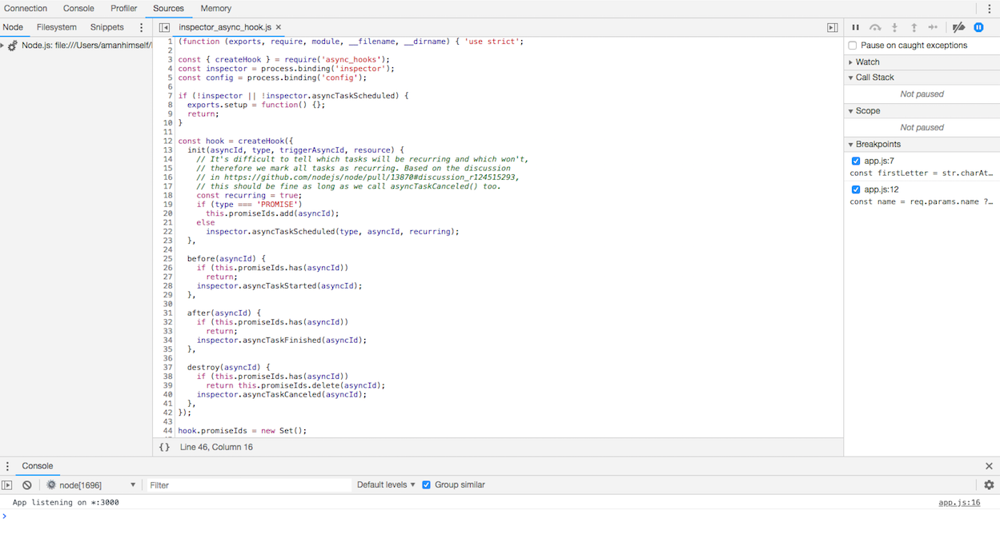
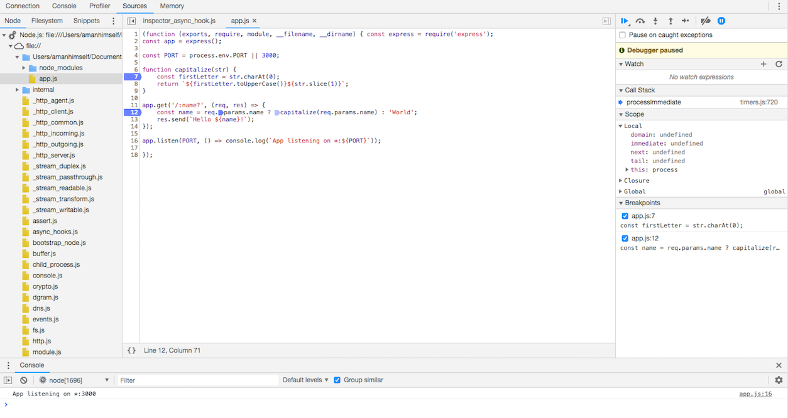

# Debugging Nodejs Application

Debugging is a process of finding and fixing errors in an application. This process is completely applicable when you are developing an application and is not to be used in production mode. Debugging Node.js application is easy and has various methods to do so. The most common one is using `console.log()`. Although this method is suitable for quick debugging of Nodejs modules, it has its drawback such as it slows the development process and prints the output on terminal even in production mode.

There are more efficient ways to debug a Nodejs application. Available tools are:

- `node inspect`
- Chrome DevTools

## node inspect

Node.js includes debugging utility to run the program in debugging mode using a command line interface. This can be accessed using `node inspect app.js` file. For example, we will use the below code. Create a file called app.js with code below.

```js
const hello = function() {
	debugger;
	return 'hello from module';
};
```

Now in command line interface, run

```shell
node inspect app.js
```

You will see the following output:


Inserting the keyword `debugger` into our code will enable a breakpoint at that position in the code where we want the debugger to stop itself. The debugger by default starts or breaks at the start and then wherever it finds the first `debugger` statement.

The command line interface comes with keys that we press from the keyboard in order to interact with the debugger. These are the general keys that can be used:

- cont, c - Continue execution
- next, n - Step next
- step, s - Step in
- out, o - Step out
- pause - Pause running code

The debugger take these keys as commands inside the terminal:

```shell
debug> s
```

## Chrome DevTools

Google's browser Chrome and Nodejs are built using same JavaScript engine called V8. Thus, chrome has an internal support for debugging a Nodejs application. The previous technique is a bit confusing and does not support debugging large or advanced usage.

```shell
node --inspect <fileName>
```

Firt, let us setup our example for this. Install `express` as a dependency and save the below code in `app.js`:

```js
const express = require('express');
const app = express();

const PORT = process.env.PORT || 3000;

function capitalize(str) {
	const firstLetter = str.charAt(0);
	return `${firstLetter.toUpperCase()}${str.slice(1)}`;
}

app.get('/:name?', (req, res) => {
	const name = req.params.name ? capitalize(req.params.name) : 'World';
	res.send(`Hello ${name}!`);
});

app.listen(PORT, () => console.log(`App listening on *:${PORT}`));
```

Now run the the Nodejs debugging command.

```shell
node --inspect app.js
```

You will be prompted with a familiar command line interface as before. This time go to your chrome based browser and open `about://insepct`. Here, you will be be able to access GUI interface to debug a Nodejs app or module using Chrome DevTools.


First click on the configure button and make sure that the target host and post numbers are valid. That is, they are the same as shown in commad line:

```shell
Debugger listening on ws://127.0.0.1:9229/2ebe0e3a-7056-404a-aee3-e57fa40aa30e
```

Next, click on the `Open dedicated DevTools` to start debugging your application’s code. button and it will popup the following window. You will be prompted with below screen. Traverse to your file location from the left side bar.



This time, we are not using `debugger` keyword. Chrome DevTools allows you to set break points from its GUI interface. Notice, the blue mark along with line number.



All the debugging controls which we eariler accessed in the commandline are now in right side bar that shows Call Stacka and Scope which is further divided into three sections, local, closure and global. Each variable or method on which the breakpoint is set can be viewed by the breakpoints section.

The advantage of using this technique to debug Node.js app is that it provide following features that can be used in different scenarios:

- to set breakpoints inside the source code
- control code execution by using step in, step out and step over
- to inspect scopes, variables, and object properties
- break on exceptions
- edit variables and functions from source code view
